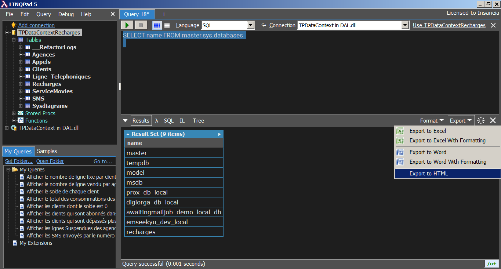

# Travaux pratique : Bases de données embarquées

1. Création de la base de données recharges:

```SQL
CREATE DATABASE recharges;

USE recharges; -- for next commands :)
```

2. Création des table Ligne_Telephonique, clients et SMS.

```SQL
--Ligne_Telephonique
CREATE TABLE [dbo].[Ligne_Telephonique](
	[Numero] [nvarchar](50) NOT NULL PRIMARY KEY,
	[DateActivationGSM] [datetime] NOT NULL,
	[CodeAgence] [nvarchar](50) NOT NULL,
	[EtatLigne] [bit] NOT NULL,
	[Agence] [nvarchar](max) NOT NULL,
	[CIN] [nvarchar](50) NOT NULL,
	CONSTRAINT [FK_Ligne_Telephonique_ToClients] FOREIGN KEY ([CIN]) REFERENCES [dbo].[Clients] ([CIN]),
	CONSTRAINT [FK_Ligne_Telephonique_ToAgence] FOREIGN KEY ([CodeAgence]) REFERENCES [dbo].[Agence] ([CodeAgence]),
	)
GO

--Clients
CREATE TABLE [dbo].[Clients](
	[CIN] [nvarchar](50) NOT NULL PRIMARY KEY,
	[Nom] [nvarchar](max) NOT NULL,
	[Prenom] [nvarchar](max) NOT NULL,
	[DateNaissance] [datetime] NOT NULL,
	[Email] [nvarchar](max) NOT NULL,
	[Password] [nvarchar](max) NOT NULL,
	[Adresse] [nvarchar](max) NOT NULL,
	[Ville] [nvarchar](max) NOT NULL,
)
GO

--SMS
CREATE TABLE [dbo].[SMS](
	[Id] [int] NOT NULL PRIMARY KEY,
	[Vers] [nvarchar](max) NOT NULL,
	[DateEnvoi] [datetime] NOT NULL,
	[TextSms] [nvarchar](max) NOT NULL,
	[PrixSms] [float] NOT NULL,
	[Numero] [nvarchar](50) NOT NULL,
	CONSTRAINT [FK_SMS_ToLigne_Telephonique] FOREIGN KEY ([Numero]) REFERENCES [dbo].[Ligne_Telephonique] ([Numero]),
)
GO
```

3. Donner le code SQL pour insère 3 clients et 6 lignes

   a. trois clients

```SQL
--1st
INSERT INTO dbo.Clients (CIN, Nom, Prenom, DateNaissance, Email, Password, Adresse, Ville)
VALUES (N'BK000000', -- CIN - nvarchar
 N'Ousrhire', -- Nom - nvarchar
 N'Abdellah', -- Prenom - nvarchar
 '1996-12-24 00:00:00', -- DateNaissance - datetime
 N'ousrhire.abdellah@gmail.com', -- Email - nvarchar
 N'123456XD', -- Password - nvarchar
 N'Addrissa :3', -- Adresse - nvarchar
 N'Casablanca' -- Ville - nvarchar
)
GO

--2nd
INSERT INTO dbo.Clients (CIN, Nom, Prenom, DateNaissance, Email, Password, Adresse, Ville)
VALUES (N'BK111111', -- CIN - nvarchar
 N'Ousrhire', -- Nom - nvarchar
 N'Abderrahim', -- Prenom - nvarchar
 '2001-03-21 00:00:00', -- DateNaissance - datetime
 N'abderrahim.ousrhire@gmail.com', -- Email - nvarchar
 N'Pass dialo', -- Password - nvarchar
 N'Addrissa :3', -- Adresse - nvarchar
 N'Casablanca' -- Ville - nvarchar
)
GO

--3rd
INSERT INTO dbo.Clients (CIN, Nom, Prenom, DateNaissance, Email, Password, Adresse, Ville)
VALUES (N'BK222222', -- CIN - nvarchar
 N'Lamba', -- Nom - nvarchar
 N'Abbass', -- Prenom - nvarchar
 '1980-01-01 00:00:00', -- DateNaissance - datetime
 N'lamba.abbass@gmail.com', -- Email - nvarchar
 N'Pass dialo tahowa', -- Password - nvarchar
 N'Addrissa dialo :3', -- Adresse - nvarchar
 N'Casablanca' -- Ville - nvarchar
)
GO
```

b. six lignes **create Agence table with data 1st**

```SQL
INSERT INTO dbo.Ligne_Telephonique (Numero, DateActivationGSM, CodeAgence, EtatLigne, Agence, CIN)
VALUES (N'0500000000', -- Numero - nvarchar
 '2020-02-21 01:19:00', -- DateActivationGSM - datetime
 N'Agence00', -- CodeAgence - nvarchar
 0, -- EtatLigne - bit
 N'Agence00', -- Agence - nvarchar
 N'BK000000' -- CIN - nvarchar
)
GO

INSERT INTO dbo.Ligne_Telephonique (Numero, DateActivationGSM, CodeAgence, EtatLigne, Agence, CIN)
VALUES (N'0511111111', -- Numero - nvarchar
 '2020-02-21 01:19:00', -- DateActivationGSM - datetime
 N'Agence00', -- CodeAgence - nvarchar
 0, -- EtatLigne - bit
 N'Agence00', -- Agence - nvarchar
 N'BK000000' -- CIN - nvarchar
)
GO

INSERT INTO dbo.Ligne_Telephonique (Numero, DateActivationGSM, CodeAgence, EtatLigne, Agence, CIN)
VALUES (N'0622222222', -- Numero - nvarchar
 '2020-02-21 01:19:00', -- DateActivationGSM - datetime
 N'Agence00', -- CodeAgence - nvarchar
 0, -- EtatLigne - bit
 N'Agence00', -- Agence - nvarchar
 N'BK111111' -- CIN - nvarchar
)
GO

INSERT INTO dbo.Ligne_Telephonique (Numero, DateActivationGSM, CodeAgence, EtatLigne, Agence, CIN)
VALUES (N'0633333333', -- Numero - nvarchar
 '2020-02-21 01:19:00', -- DateActivationGSM - datetime
 N'Agence00', -- CodeAgence - nvarchar
 0, -- EtatLigne - bit
 N'Agence00', -- Agence - nvarchar
 N'BK111111' -- CIN - nvarchar
)
GO

INSERT INTO dbo.Ligne_Telephonique (Numero, DateActivationGSM, CodeAgence, EtatLigne, Agence, CIN)
VALUES (N'0644444444', -- Numero - nvarchar
 '2020-02-21 01:19:00', -- DateActivationGSM - datetime
 N'Agence00', -- CodeAgence - nvarchar
 0, -- EtatLigne - bit
 N'Agence00', -- Agence - nvarchar
 N'BK222222' -- CIN - nvarchar
)
GO

INSERT INTO dbo.Ligne_Telephonique(Numero, DateActivationGSM, CodeAgence, EtatLigne, Agence, CIN)
VALUES(N'0661000000', --Numero - nvarchar
 '2020-02-21 01:19:00', --DateActivationGSM - datetime
 N'Agence00', --CodeAgence - nvarchar
 0, --EtatLigne - bit
 N'Agence00', --Agence - nvarchar
 N'BK222222'-- CIN - nvarchar
)
GO
```

4. Afficher les clients qui sont abonnés dans les agences de Casablanca.

```SQL
SELECT
   *
FROM
   [dbo].[clients] AS [client]
WHERE
   EXISTS
   (
      SELECT
         1
      FROM
         [dbo].[ligne_telephonique] AS [ligne]
         INNER JOIN
            [dbo].[agence] AS [agence]
            ON [ligne].[codeagence] = [agence].[codeagence]
      WHERE
         (
            [client].[cin] = [ligne].[cin]
         )
         AND
         (
            N'Casablanca' = [agence].[ville]
         )
   )
```

5. Afficher le nombre de ligne fixe par client [Numéro commence par 05]

```SQL
SELECT
   [query].[cin] AS [CIN],
   Concat([query].[nom], N' ', [query].[prenom]) AS [Client Name],
   [query].[line count] AS [Line Count]
FROM
   (
      SELECT
         [client].[cin] AS [CIN],
         [client].[nom] AS [Nom],
         [client].[prenom] AS [Prenom],
         (
            SELECT
               Count(1) AS [A1]
            FROM
               [dbo].[ligne_telephonique] AS [ligne]
            WHERE
               [client].[cin] = [ligne].[cin]
         )
         AS [line count]
      FROM
         [dbo].[clients] AS [client]
      WHERE
         EXISTS
         (
            SELECT
               1 AS [line count]
            FROM
               [dbo].[ligne_telephonique] AS [ligne exists]
            WHERE
               (
                  [client].[cin] = [ligne exists].[cin]
               )
               AND
               (
                  [ligne exists].[numero] LIKE N'05%'
               )
         )
   )
   AS [query]
```

7. Afficher les SMS envoyés par le numéro 0661000000

```SQL
SELECT
   [ligne].[numero] AS [Ligne],
   (
      SELECT
         Count(*)
      FROM
         [sms] AS [sms]
      WHERE
         [sms].[numero] = [ligne].[numero]
   )
   AS [SMSCount]
FROM
   [ligne_telephonique] AS [ligne]
WHERE
   [ligne].[numero] = '0661000000'
```

8. Afficher le nombre de ligne vendu par agence.

```SQL
SELECT
   [query].[codeagence] AS [CodeAgence],
   [query].[c1] AS [SoldLineCount]
FROM
   (
      SELECT
         [agence].[codeagence] AS [CodeAgence],
         (
            SELECT
               Count(1) AS [A1]
            FROM
               [dbo].[ligne_telephonique] AS [ligne]
            WHERE
               [agence].[codeagence] = [ligne].[codeagence]
         )
         AS [C1]
      FROM
         [dbo].[agence] AS [agence]
   )
   AS [query]
```

9. Afficher les lignes Suspendues des agences de la ville de Casablanca

```SQL
SELECT
   [ligne].[numero] AS[Numero],
   [ligne].[codeagence] AS[CodeAgence],
   [ligne].[etatligne] AS[EtatLigne]
FROM
   [dbo].[ligne_telephonique] AS[ligne]
   INNER JOIN
      [dbo].[agence] AS[agence]
      ON[ligne].[codeagence] = [agence].[codeagence]
WHERE
   (
      [ligne].[etatligne] <> 1
   )
   AND
   (
      N'Casablanca' = [agence].[ville]
   )
```

10. Afficher le solde de chaque client

```SQL
SELECT
   [query].[CIN] AS [ClientCIN],
   [query].[Numero] AS [LineNumber],
   CASE
      WHEN
         (
            [query].[lb2] IS NULL
         )
      THEN
         0
      ELSE
         [query].[lb1]
   END
   AS [LineBalance]
FROM
   (
      SELECT
         [internalQuery].[Numero] AS [Numero],
         [internalQuery].[CIN] AS [CIN],
         [internalQuery].[lb2] AS [lb2],
         (
            SELECT
               SUM([recharge1].[Solde]) AS [A1]
            FROM
               [dbo].[Recharge] AS [recharge1]
            WHERE
               [internalQuery].[Numero] = [recharge1].[Numero]
         )
         AS [lb1]
      FROM
         (
            SELECT
               [ligne].[Numero] AS [Numero],
               [ligne].[CIN] AS [CIN],
               (
                  SELECT
                     SUM([recharge2].[Solde]) AS [A1]
                  FROM
                     [dbo].[Recharge] AS [recharge2]
                  WHERE
                     [ligne].[Numero] = [recharge2].[Numero]
               )
               AS [lb2]
            FROM
               [dbo].[Ligne_Telephonique] AS [ligne]
         )
         AS [internalQuery]
   )
   AS [query]
```

11. Afficher les clients qui sont dépassés plus de 20 SMS

```SQL
SELECT
   [query].[cin] AS [LineClientCIN],
   [query].[numero] AS [LineNumber]
FROM
   (
      SELECT
         [ligne].[numero] AS [Numero],
         [ligne].[cin] AS [CIN],
         (
            SELECT
               Count(1) AS [A1]
            FROM
               [dbo].[sms] AS [Extent2]
            WHERE
               [ligne].[numero] = [Extent2].[numero]
         )
         AS [countSMS]
      FROM
         [dbo].[ligne_telephonique] AS [ligne]
   )
   AS [query]
WHERE
   [query].[countsms] > 20
```

12. Afficher les clients dont le solde est 0(I can get clients with all line balance is 0 or the other way since a client may have more than one line + i should take expiration date into account maybe duree or dataRecharge...)

```SQL
SELECT
   [query].[cin] AS [ClientCIN],
   [query].[numero] AS [ClientNumero]
FROM
   (
      SELECT
         [ligne].[numero] AS [Numero],
         [ligne].[cin] AS [CIN],
         (
            SELECT
               Sum([recharge].[solde]) AS [A1]
            FROM
               [dbo].[recharge] AS [recharge]
            WHERE
               [ligne].[numero] = [recharge].[numero]
         )
         AS [sumBalance]
      FROM
         [dbo].[ligne_telephonique] AS [ligne]
   )
   AS [query]
WHERE
   0 = [query].[sumbalance]
```

[//]: # 'TODO when you have time'

13. Afficher le total des consommations des clients de la ville de Rabat (what total? sms/ internet/ movies/ ???) i'll go with this (total PrixSMS, Total des appels et total des abonnements au service Movies) -- Total des appels => assuming that finComm is total secondes then it's finComm x PrixPerSecond

```SQL
-- TODO later
```

[//]: # 'TODO copy pasta but with specific client id'

14. Afficher le total des consommations [total PrixSMS, Total des appels et total des abonnements au service Movies) de client dont le CIN est B 178585. (same as the one above just with specific client CIN...)

```SQL
-- TODO later
```

15. Réaliser un trigger permettant d’empêcher l’insertion d’une nouvelle ligne si le numéro déjà utilisée

```SQL
CREATE TRIGGER PreventPhoneLineDups
ON [dbo].[ligne_telephonique] AFTER INSERT AS if exists
(
   select
      *
   from
      table t
      inner join
         inserted i
         on i.Numero = t.Numero
)
BEGIN
   ROLLBACK RAISERROR ('Number already in use, use another!', 16, 1);
END
GO
```

[//]: # 'TODO later'

16. Réaliser un trigger permettant d’empêcher l’insertion d’une nouveau SMS si le numéro destination non existe

```SQL
-- TODO later
```

17. Créer un index (nom et email) dans la table client (name should be a fixed nvarchar(50) for example for this to work in my db)

```SQL
CREATE INDEX Index_LastName_Email ON dbo.Clients(Nom,Email);
```

18. Donner les commandes => Pour afficher les résultats en colonnes

```SQL
-- TODO later
```

19. Donner les commandes => Pour afficher les bases de données.

```SQL
SELECT name FROM master.sys.databases
```

20. Donner les commandes => Pour exporter les données en format HTML.

I can use

[SQL Server Import/Export Wizard](https://docs.microsoft.com/en-us/sql/integration-services/import-export-data/import-and-export-data-with-the-sql-server-import-and-export-wizard?view=sql-server-ver15)

[Or something like this](https://www.red-gate.com/simple-talk/blogs/generating-html-sql-server-queries/)

or using a software


